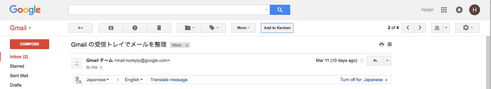
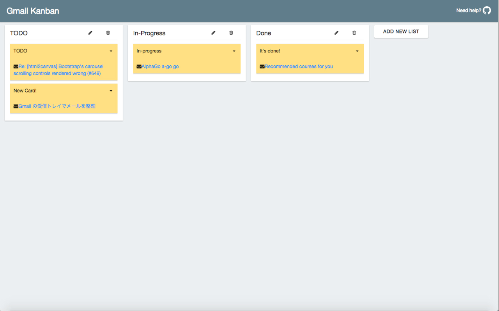

# GmailKanban

Gmail Kanban is a simple browser extension Kanban tool for Gmail users. You can create a task card from your gmail.   
Just click "Add to Kanban" button on your gmail.

- It's very simple.
- You don't need to worry about your privacy. All data of your e-mail and card is stored in browser's local storage only.

## Install

(currently only support chrome)

* Install from [Chrome Web Store](https://chrome.google.com/webstore/detail/gmail-kanban/lbedfpnhebkdgelkicpjfegneocfapdo) or download [chrome.crx](dist/chrome.crx) file.